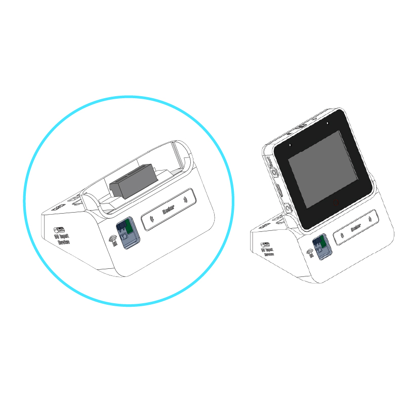
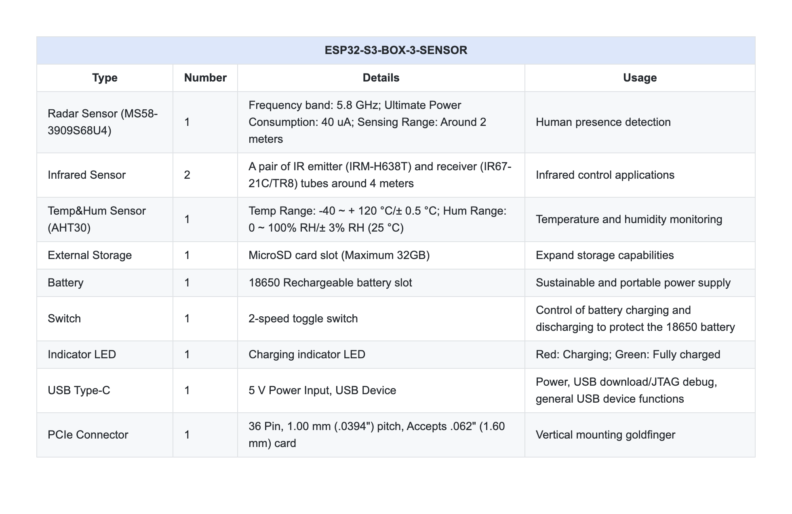
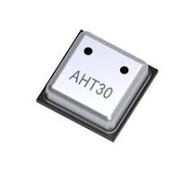

# Senzor manager (sensor_manager)

S komponento sensor_manager merimo temperature prostora z I2C senzorjem AHT30 vgrajenim v ESPS3-BOX-3 

  
  
  

## O I2C protokolu
https://www.3dsvet.eu/osnove-komunikacijskega-protokola-i2c/  

I2C (Inter-Integrated Circuit) je protokol, ki omogoča komunikacijo med napravami preko dveh žic: SDA (Serial Data Line) za prenos podatkov in SCL (Serial Clock Line) za časovno usklajevanje. Ta protokol vključuje tudi povezavo do mase in VCC za napajanje. Uporovniki, običajno med 2.2kΩ do 10kΩ, ohranjajo SDA in SCL v visokem stanju, ko so v mirovanju. Vsaka naprava v mreži potrebuje edinstven naslov, kar omogoča komunikacijo med več napravami z minimalno ožičenjem.

  

Protokol podrobno : https://www.analog.com/en/resources/technical-articles/i2c-primer-what-is-i2c-part-1.html

### ESP32-S3-SENSOR-01_V1.1 senzor AHT30  Specifikacije  vezane na kodo

  

https://eleparts.co.kr/data/goods_attach/202306/good-pdf-12751003-1.pdf

KAJ PA TO !!!!!!!!!!!!!!!!!!!!!
https://components.espressif.com/components/espressif/aht30/versions/1.0.0/readme

Povzetek :

- I2C_MASTER_SCL_IO           40      
- I2C_MASTER_SDA_IO           41  
- I2C_MASTER_FREQ_HZ          100000  
- I2C_MASTER_TIMEOUT_MS       1000
- AHT30_I2C_ADDR              0x38 
- AHT30_CMD_INIT              0xBE
- AHT30_CMD_TRIGGER           0xAC 
- AHT30_CMD_SOFT_RESET        0xBA 
- AHT30_MEASUREMENT_DELAY_MS  80  

## Features

- Real-time temperature and humidity display
- AHT21 sensor integration via I2C
- LVGL-based user interface
- ESP32-BOX-3 hardware support

## Hardware Requirements

- ESP32-BOX-3 development board
- AHT21 temperature and humidity sensor connected to:
  - SCL: GPIO40
  - SDA: GPIO41

## Software Requirements

- ESP-IDF framework
- LVGL graphics library
- ESP-BSP (Board Support Package)

## Building and Flashing

1. Set up ESP-IDF environment
2. Navigate to the project directory
3. Configure the project: `idf.py menuconfig`
4. Build the project: `idf.py build`
5. Flash to device: `idf.py flash`
6. Monitor output: `idf.py monitor`

## Usage

The application initializes the display and sensor, then continuously reads and displays temperature and humidity every 2 seconds. If sensor initialization fails, it displays an error message on the screen.

## Components

- `display_manager`: Handles LCD display initialization and brightness control
- `sensor_manager`: Manages AHT21 sensor communication and data reading

## License

[Add license information here]# TermostatBox3
